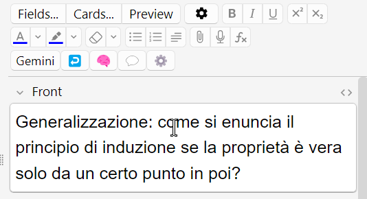
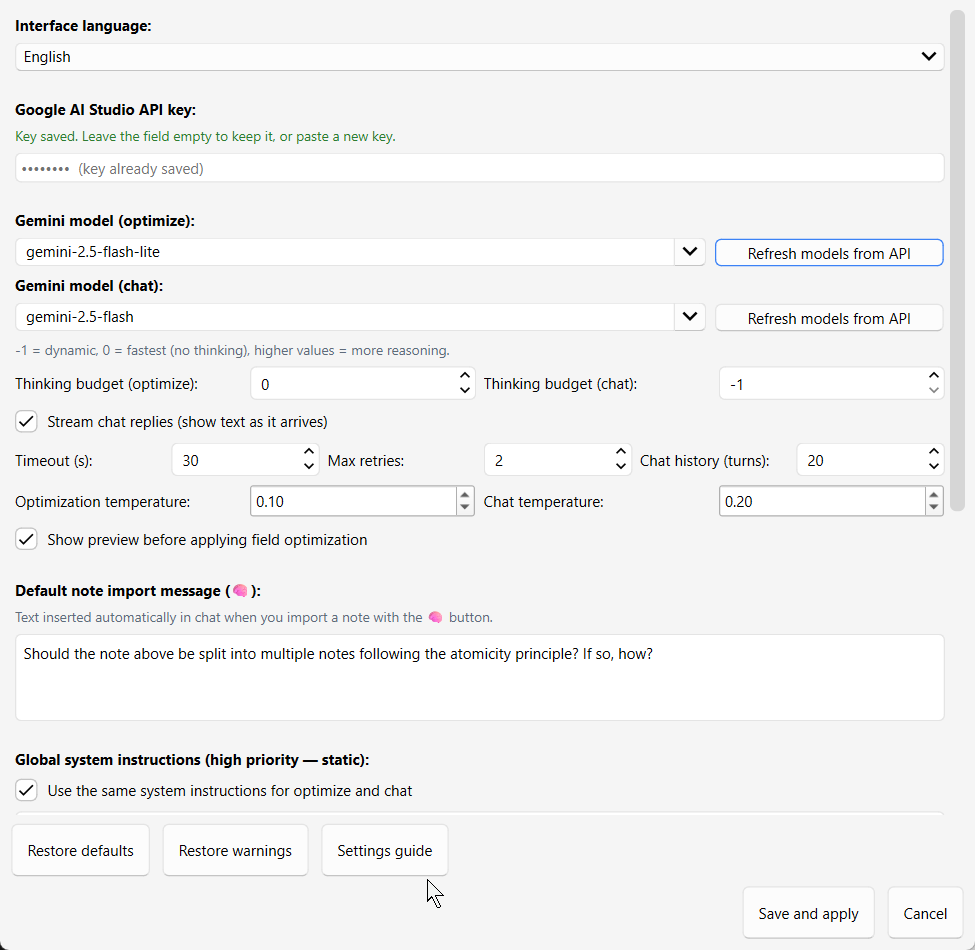

# Anki AI Assistant (Gemini)

An Anki add-on that integrates **Google Gemini** into the note editor: optimize HTML/MathJax fields, chat about your notes, and analyze whether a note should be split for atomicity.

**Repository:** [github.com/Raffaelerrr/anki-gemini-integration](https://github.com/Raffaelerrr/anki-gemini-integration)  
**Version:** 2.0.0 · see [CHANGELOG.md](CHANGELOG.md)  
**Author:** Raffaele  
**Requires:** Anki 2.1.49+ (point version 49)  
**License:** [MIT](LICENSE)

> **Disclaimer:** This add-on was developed with substantial assistance from AI coding tools (including Cursor and large language models). The author reviewed and tested the project, but errors or unexpected behavior may remain. Use at your own discretion.

---

## Screenshots

UI mockups for documentation (replace with real Anki screenshots anytime):

| Editor buttons | Settings dialog |
|----------------|-----------------|
|  |  |

---

## Features

### Field optimization (`Gemini` · `Ctrl+Shift+G` / `Cmd+Shift+G`)

Optimizes the **currently focused field** using your system instructions (HTML structure, MathJax `\(...\)` / `\[...\]`, plain-math conversion, custom rules). Uses a dedicated model and thinking budget tuned for fast edits. Optional **preview before apply** and **undo (↩)** for the last optimization in the session.

### Note analysis (`🧠`)

Imports **all fields** of the current note into chat and asks Gemini whether the note should be decomposed into smaller atomic cards.

### Chat (`💬` · `Ctrl+Alt+C` / `Cmd+Alt+C`)

Streaming chat with Markdown replies. When Gemini suggests Anki field content, **copy buttons** appear on code blocks. Also in **Tools → Chat with Gemini**.

### Settings (`⚙️`)

- **API key**, models, thinking budgets, temperatures, timeouts
- **Shared or split system instructions** (optimize vs chat)
- **Dynamic rules** learned from chat
- **Settings guide** (ℹ) — help while you edit
- **Restore defaults** / **Restore warnings** — selective reset
- **Filterable model picker** with API refresh
- **English / Italian** interface
- **Light / dark** theme following Anki

---

## Quick start

1. **Install** (see below) and restart Anki.
2. Open any note → click **⚙️** in the editor (or **Tools → Add-ons → Config**).
3. Paste your [Google AI Studio](https://aistudio.google.com/) API key → **Save and apply**.
4. Focus a field → **Gemini** (or `Ctrl+Shift+G`) to optimize.

---

## Installation

### From GitHub

```bash
git clone https://github.com/Raffaelerrr/anki-gemini-integration.git
```

Or download a ZIP from the repository page.

Then:

1. Place the folder in your Anki add-ons directory:
   - **Windows:** `%APPDATA%\Anki2\addons21\`
   - **macOS:** `~/Library/Application Support/Anki2/addons21/`
   - **Linux:** `~/Anki/addons21/`
2. The folder name can be anything Anki accepts (e.g. `Anki_AI_Addon` or `anki-gemini-integration`).
3. Restart Anki.
4. Configure your API key in settings (⚙️).

> **Not on AnkiWeb yet** — install from GitHub for now.

### API key

- Created at [Google AI Studio](https://aistudio.google.com/)
- Stored **locally** by Anki in `meta.json` (never committed — see `.gitignore`)
- Leave the key field **empty** when saving to keep the existing stored key
- **Restore defaults** leaves API key **unchecked** by default; clearing it shows a confirmation (dismissible)

---

## Configuration

Settings are saved in Anki’s local `meta.json`. Example schemas:

| File | Purpose |
|------|---------|
| `config.example.json` | Full settings schema |
| `meta.example.json` | Anki `{"config": …}` wrapper |
| `config_gemini.example.json` | Legacy format (auto-migrated) |

Use the **⚙️** dialog for normal setup; manual file copy is rarely needed.

### Main options

| Option | Default | Description |
|--------|---------|-------------|
| `language` | `en` | Interface language (`en` or `it`) |
| `model_optimize` | `gemini-2.5-flash-lite` | Model for field optimization |
| `model_chat` | `gemini-2.5-flash` | Model for chat / 🧠 analysis |
| `thinking_budget_optimize` | `0` | Thinking tokens for optimize (`0` = off) |
| `thinking_budget_chat` | `-1` | Thinking tokens for chat (`-1` = dynamic) |
| `chat_streaming` | `true` | Stream chat replies |
| `temperature_optimize` | `0.1` | Creativity for optimization |
| `temperature_chat` | `0.2` | Creativity for chat |
| `timeout_seconds` | `30` | API timeout |
| `max_retries` | `2` | Retries on transient errors |
| `max_history_turns` | `20` | Chat history length |
| `confirm_before_apply` | `true` | Preview before applying optimization |
| `system_instruction_shared` | `true` | One instruction set for optimize + chat |
| `system_instruction` | *(built-in)* | Shared static instructions (when shared) |
| `system_instruction_optimize` | *(built-in)* | Optimize-only instructions (when split) |
| `system_instruction_chat` | *(built-in)* | Chat-only instructions (when split) |
| `dynamic_instructions` | `""` | Lower-priority rules from chat |
| `brain_import_message` | *(built-in)* | Prompt for 🧠 note import |

Built-in system instructions include Anki HTML/MathJax rules and **convert plain math to MathJax** (`\(...\)` / `\[...\]`, no `$`/`$$`).

Legacy single `model` / `thinking_budget` keys migrate automatically.

---

## Shortcuts

| Action | Windows / Linux | macOS |
|--------|-----------------|-------|
| Optimize field | `Ctrl+Shift+G` | `Cmd+Shift+G` |
| Open / focus chat | `Ctrl+Alt+C` | `Cmd+Alt+C` |

---

## Development

Git ignores secrets and generated files (`meta.json`, `config_gemini.json`, `__pycache__/`, etc.).

`vendor/` bundles [Python-Markdown](https://python-markdown.github.io/) for chat formatting.

### Run offline tests

```bash
py -3 tests/test_offline.py
```

### Update vendored Markdown

```bash
py -m pip install markdown --target vendor --upgrade
```

Remove old `*.dist-info` folders if duplicates appear after upgrading.

---

## Privacy & cost

Note field content and chat messages are sent to **Google’s Gemini API** using **your** API key. Review [Google’s terms](https://ai.google.dev/gemini-api/terms). API usage may incur charges depending on your Google account / quota.

---

## License

[MIT License](LICENSE) — see [LICENSE](LICENSE) for full text.
